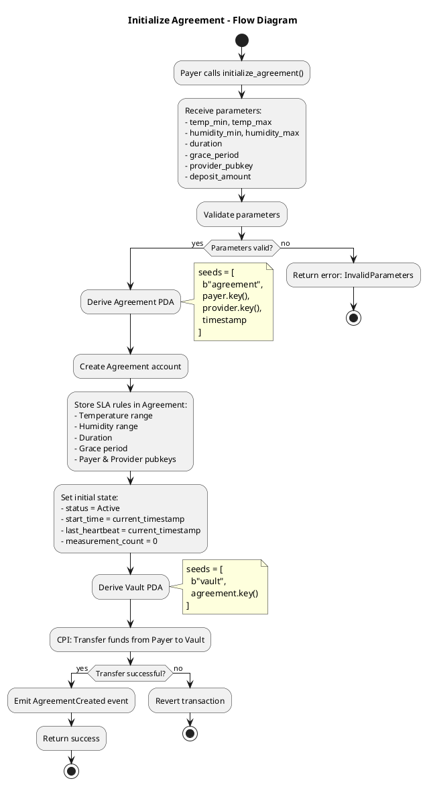
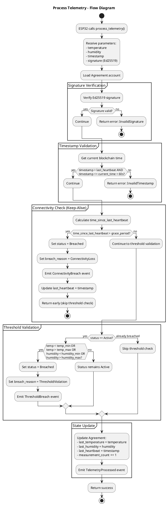
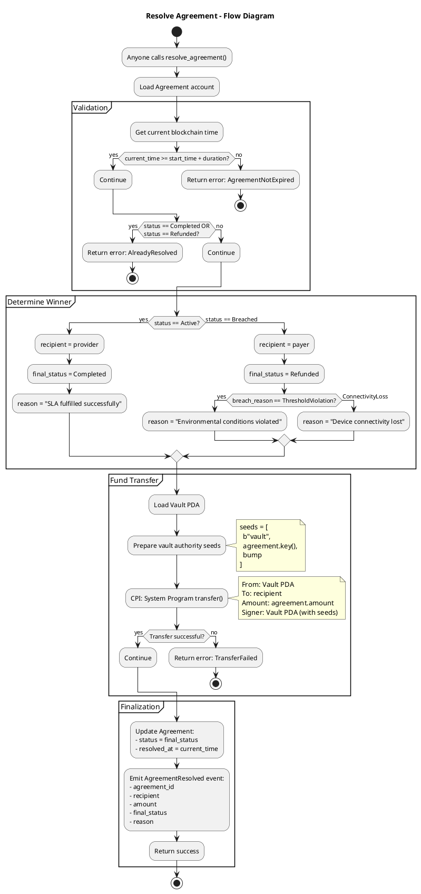

# Enviphy Program - Function Flow Diagrams

This document contains detailed flow diagrams for each instruction in the Enviphy smart contract.

---

## 1. Initialize Agreement

Creates a new environmental monitoring agreement by setting up PDAs and locking funds in escrow.

---

## 2. Process Telemetry

Validates and processes environmental data from the ESP32 oracle, checking signatures, thresholds, and connectivity.

**MVP Implementation:** For the capstone, telemetry data will be simulated through hardcoded values or manual input via frontend/tests. The cryptographic signature validation will use standard Solana wallets instead of ESP32 keypairs. Post-MVP, this will be replaced with actual ESP32-signed telemetry submitted via a relay bridge. ESP32 integration planned for post-capstone phase.

---

## 3. Resolve Agreement

Executes final settlement by reading the agreement status and transferring funds to the appropriate party.

---
## Summary

| Function | Caller | Purpose | Key Validations |
|----------|--------|---------|-----------------|
| **initialize_agreement** | Payer | Create agreement & lock funds | Parameter validity, fund transfer |
| **process_telemetry** | ESP32 Oracle | Validate & update state | Signature, timestamp, thresholds, connectivity |
| **resolve_agreement** | Anyone | Execute settlement | Expiration, not already resolved |

---

## Notes

- All functions emit events for audit trail purposes
- PDAs are derived deterministically using program-defined seeds
- Cross-Program Invocations (CPIs) are used for fund transfers via System Program
- The settlement logic is permissionless - anyone can trigger `resolve_agreement` after expiration