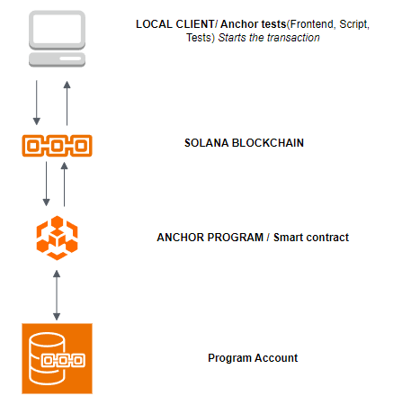

# ⚙️ Program Specifications

## 1. User Story

> As a sports complex administrator, I want a simple, on-chain counter to track how many courts are currently reserved, so I can prevent the total number of reservations from exceeding the complex's maximum capacity.

---

### **1.1 Acceptance Criteria (AC)**

- **1:** The complex must be successfully initialized with a defined maximum number of courts.
- **2:** A reservation must succeed and increment the counter if the current count is less than the maximum capacity.
- **3:** A reservation must fail if the current count has reached the maximum capacity.
- **4:** A cancellation must succeed and decrement the counter if the current count is greater than zero.
- **5:** A cancellation must fail if the current count is equal to zero.
- **6:** The designated authority must be able to reset the total reservation count to zero.
- **7:** Any user who is not the designated authority must be prevented from resetting the counter.

---

## 1.2. User Testing Scenarios (UAT)
1.  **1 (Initialization):** Test initializing with a max capacity of 3 courts and a reservation count of 0 (Passes).
2.  **2 (Reserve Success):** Test reserving courts successfully and there is enough capacity (Passes).
3.  **3 (Capacity Reached):** Test reserving a court when the max capacity is reached (fails).
4.  **4 (Cancel Success):** Test canceling a reservation when reservations are active (Passes).
5.  **5 (Cancel When Empty):** Test canceling a reservation when the counter is zero(fails).
6.  **6 (Reset Success):** Test resetting the total reservation count to zero being the designated authority (Passes).
7.  **7 (Unauthorized Reset):** Test resetting the total reservation count to zero without being the designated authority (fails).
---

## 2. Architecture and Design

The application follows the standard Solana architecture, as shown in the diagram below, where a client initiates a transaction that is processed by the on-chain program, which then modifies data stored in its dedicated state account.

### Architectural Diagram

### Architectural Flow

1.  **Local Client / Anchor Tests (Initiator):** The Anchor test script **starts the transaction**, providing the necessary inputs and account addresses.
2.  **Solana Blockchain:** The network validates the transaction, confirms fees, and routes the instruction to the correct on-chain program.
3.  **Anchor Program / Smart Contract (Business Logic):** The Rust code handles the instruction (e.g., `reserve_court`), executes the business logic (checks capacity), and ensures security checks (e.g., signer authorization).
4.  **State Account (Data Storage):** The program reads and updates the data stored in its program-owned state account (`Complex`).